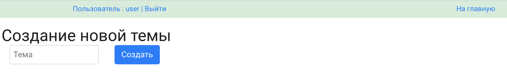

# Форум
 
Стек технологий:
* JSP/JSTL
* Java 14
* Apache Tomcat
* JDBC/JPA/Hibernate
* Junit Tests
* Spring (Boot, Security)

Реализованы роли (Администратор, Пользователь).

__Страница авторизации__

__Главная страница__
 - отображение списка тем. Доступно редактирование, добавление новой темы.

 
 __Создание новой темы__

__Редактирование темы__

  
  __Страница обсуждения выбранной темы__
  - Доступно редактирование поста

    
__Страница редактирования поста__
  - Доступно редактирование и удаление поста

  
  

 

